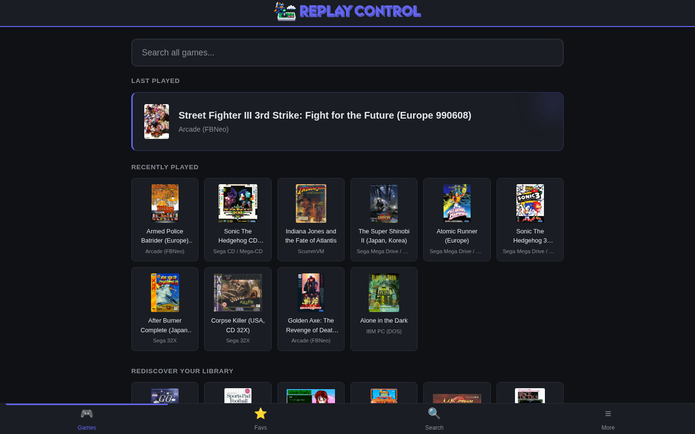
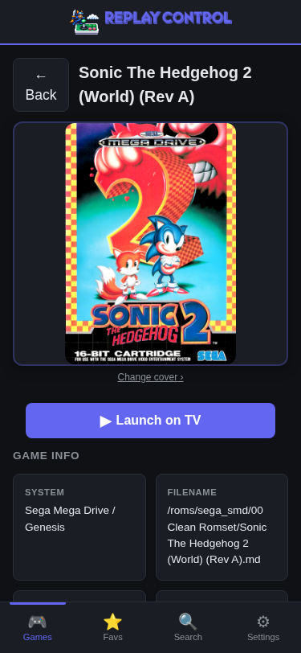

# Replay Control

<p align="center">
  
</p>

<p align="center">
  A companion web app for <a href="https://www.replayos.com/">RePlayOS</a> — manage ROMs, favorites, and settings from any device on the local network.
</p>

<p align="center">
  <a href="https://lapastillaroja.github.io/replay-control/">Documentation</a>
</p>

<p align="center">
  <a href="https://github.com/lapastillaroja/replay-control/actions"></a>
  <a href="LICENSE"></a>
</p>

---

This is a personal project born from my love for retro gaming on real hardware. I built it because I wanted a better way to manage my game library on [RePlayOS](https://www.replayos.com/). Feedback, ideas, and pull requests are welcome — though I'll implement things based on what feels right for the project.

---

<p align="center">
  
</p>

<p align="center">
  <em>Home page on desktop. Mobile game detail below.</em>
</p>

<p align="center">
  
</p>

## Features

### Browse & Manage

- Browse games by system with box art, search, and infinite scroll
- Favorites with organize-by-genre, system, or developer subfolders
- Multi-disc game handling — auto-generates M3U playlists, hides individual disc files
- Inline rename and delete with multi-file safety (CUE+BIN, M3U+discs, ScummVM)
- Arcade display names — 15K+ playable entries show human-readable titles instead of codenames
- Automatic library updates — new, changed, or deleted ROMs are detected live
- Consistent game cards with box art, badges, and favorite toggle across every view

### Discover

- Personalized recommendations on the home page: Rediscover Your Library, Top Rated, Multiplayer, Because You Love, and more
- Curated Spotlight — a rotating section that highlights a different angle each visit: best by genre, best of system, games by developer, or hidden gems
- Discover pills — quick-links to browse by genre, system, developer, decade, or multiplayer mode
- Cross-system search with word-level fuzzy matching against filenames and display names
- Developer pages — dedicated game list per developer with system filter chips and infinite scroll
- Recent searches and Random Game button

### Game Detail

- Box art, in-game screenshots, title screens, and user-captured screenshots with fullscreen lightbox
- Pin YouTube/Twitch/Vimeo trailers and gameplay videos — privacy-respecting embeds via Invidious/Piped
- Series navigation with sequel/prequel links across systems (< Prev | 2 of 5 | Next >)
- Regional variants, translations, hacks, and arcade versions in collapsible sections
- Game manuals — in-folder detection plus on-demand download from archive.org
- Launch games on the TV from the web UI with visual feedback
- Related games and "Also available on" cross-system recommendations

### Metadata & Media

- Embedded databases: ~34K console ROMs and ~15K playable arcade games — display names, genres, player counts, developer, and year data with no internet required
- One-click LaunchBox metadata import (~100 MB download, ~460 MB XML) for descriptions, ratings, genres, publishers — fast streaming parse (~6s on Pi)
- Per-system or batch box art download from libretro-thumbnails with smart multi-tier matching
- ~5,345 game series entries across 194+ franchises with sequel/prequel chains from Wikidata
- Box art swap — pick alternate region-variant covers from the full libretro-thumbnails catalog

### Settings & System

- Wi-Fi, NFS share, hostname, and password change from the browser
- Skin/theme sync with RePlayOS — changes push instantly to all connected browsers
- Region preference for sort order, search scoring, and recommendation dedup
- Storage auto-detection (SD, USB, NVMe, NFS) with corruption recovery banners
- System info, disk usage, network addresses, and live system logs

### User Experience

- PWA — installable as a home screen app with offline fallback
- Streaming SSR — layout appears instantly with skeleton placeholders, content fills in progressively
- Responsive design from phones to desktops
- Instant page loads with smart multi-layer caching

## Roadmap

Planned, not yet available (in no particular order):

- Improved game detail page UI and resource management
- Deeper RePlayOS integration via the newly released official API
- New Now Playing UI and controls
- DMDos integration

## Quick Install

Works on **Windows 10+, macOS, and Linux** — all three ship with SSH built in. SSH into your Pi, then run the installer:

```bash
ssh root@replay.local
# default password: replayos
curl -fsSL https://raw.githubusercontent.com/lapastillaroja/replay-control/main/install.sh | bash
```

If `replay.local` doesn't resolve (common on Windows and in VMs), find the Pi's IP in your router's connected-devices list and use `ssh root@<ip>` instead.

<details>
<summary>More install options</summary>

**Run from another computer (Linux/macOS only, no SSH session):**
```bash
curl -fsSL https://raw.githubusercontent.com/lapastillaroja/replay-control/main/install.sh | bash
```
The installer auto-discovers your Pi via mDNS and SSHes in for you. Doesn't work on Windows — use the SSH-first flow above.

**Specific version (run on the Pi after SSHing in):**
```bash
curl -fsSL https://raw.githubusercontent.com/lapastillaroja/replay-control/main/install.sh | bash -s -- --version v0.2.0
```

**Skip discovery from another computer (specify Pi address):**
```bash
curl -fsSL https://raw.githubusercontent.com/lapastillaroja/replay-control/main/install.sh | bash -s -- --ip 192.168.1.50
```

**Custom SSH password (when running from another computer):**
```bash
curl -fsSL https://raw.githubusercontent.com/lapastillaroja/replay-control/main/install.sh | bash -s -- --pi-pass mypassword
```

**Install to SD card (before first boot — Linux/macOS only, needs ext4):**
```bash
curl -fsSL https://raw.githubusercontent.com/lapastillaroja/replay-control/main/install.sh | bash -s -- --sdcard /path/to/mounted/sdcard
```

**Dry run (preview without changes):**
```bash
curl -fsSL https://raw.githubusercontent.com/lapastillaroja/replay-control/main/install.sh | bash -s -- --dry-run
```

See [GitHub Releases](https://github.com/lapastillaroja/replay-control/releases) for all versions.

</details>

## About RePlayOS

RePlayOS is a Linux distribution featuring a custom libretro frontend for retro gaming on Raspberry Pi, with LCD and CRT support.

**Official site:** https://www.replayos.com/

## Tech Stack

- **Rust** — single binary, cross-compiled for ARM (aarch64)
- **Leptos 0.7** — SSR with WASM hydration
- **Axum** — HTTP server, REST API, SSE
- **SQLite** — metadata cache via deadpool-sqlite connection pool
- **No cargo-leptos** — custom build pipeline (`build.sh`)

## Build & Run

```bash
# Local development (auto-rebuild + reload)
./dev.sh --storage-path /path/to/roms

# Deploy to Pi
./dev.sh --pi [IP]

# Release build
./build.sh              # x86_64
./build.sh aarch64      # Pi cross-compile
```

See [CONTRIBUTING.md](CONTRIBUTING.md) for prerequisites, cross-compilation setup, and development tips.

## Project Structure

```
replay-control/
├── replay-control-core/    — shared library (game DBs, ROM parsing, metadata, settings)
├── replay-control-app/     — web app (Leptos SSR + WASM hydration, Axum server)
├── replay-control-libretro/ — libretro core for TV display (.so)
├── scripts/                — data download scripts (No-Intro, TGDB, Wikidata)
├── tools/                  — analysis scripts, benchmarks, icon generation
├── docs/                   — feature and architecture documentation
├── build.sh                — release build (WASM + server)
├── dev.sh                  — development (auto-reload, Pi deployment)
└── install.sh              — Pi installation (SSH or SD card)
```

## Documentation

- [Features](docs/features/) — what the app does
- [Architecture](docs/architecture/) — how it works under the hood
- [Contributing community metadata](docs/contributing/community-metadata.md) — add box art, descriptions, and links for games not covered by upstream sources (e.g. AmigaVision, aftermarket ROMs)

## Third-Party Resources

### Embedded Data (build time)
- **No-Intro DATs** — ROM identification, via [libretro-database](https://github.com/libretro/libretro-database) (MIT)
- **TheGamesDB** — game metadata (year, genre, developer, publisher, players, coop, rating), via [TheGamesDB](https://thegamesdb.net/) (GPLv3 codebase). Name lookups fetched via API at build time.
- **MAME / FBNeo** — arcade databases, via [libretro-database](https://github.com/libretro/libretro-database) (MIT/MAME License)
- **Wikidata** — game series relationships (CC0)
- **MiSTer Manual Downloader** — bundled manual link indexes ([GitHub](https://github.com/antiKk/MiSTer_ManualDownloader)); only URLs are redistributed, PDFs download on demand when a user saves a manual
- **Retrokit manuals** — bundled manual link indexes from the [retrokit-manuals Archive.org collection](https://archive.org/download/retrokit-manuals); only URLs are redistributed, PDFs download on demand when a user saves a manual

### Runtime Data (user-initiated downloads)
- **LaunchBox XML** — game descriptions, ratings, publishers ([launchbox-app.com](https://gamesdb.launchbox-app.com/)) — not redistributed, downloaded by user
- **libretro-thumbnails** — box art, screenshots, title screens ([GitHub](https://github.com/libretro-thumbnails)) — not redistributed, downloaded by user

### UI Assets
- **System controller icons** — [KyleBing/retro-game-console-icons](https://github.com/KyleBing/retro-game-console-icons) (GPLv3)
- **Phosphor Icons** — top bar icons ([phosphoricons.com](https://phosphoricons.com/)) (MIT)
- **Lucide Icons** — inline UI control icons ([lucide.dev](https://lucide.dev/)) (ISC)

## AI Transparency

This project was developed with significant AI assistance (primarily Claude by Anthropic). The author reviews, understands, tests, and maintains all code. See [AI_POLICY.md](AI_POLICY.md) for contribution guidelines.

## License

GPLv3 — see [LICENSE](LICENSE).
