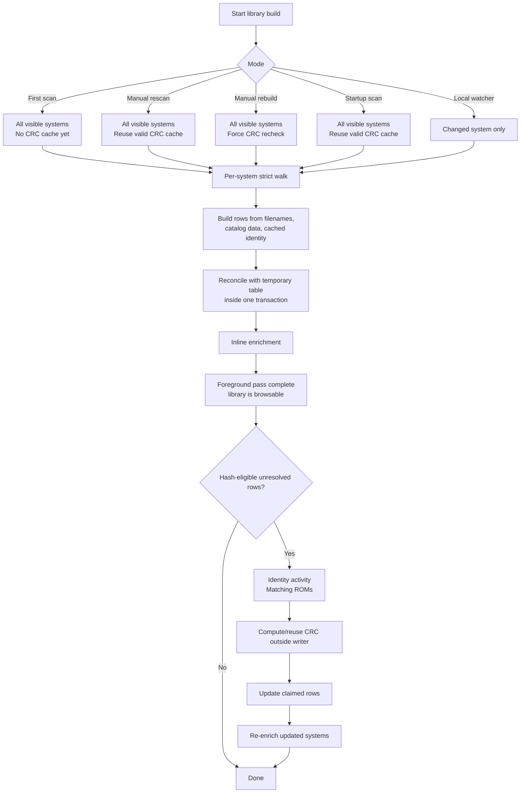

# Library Build Pipeline

This page documents the scan/rescan/rebuild path that populates `library.db`.
The goal is to keep the library correct on large ROM sets and high-latency NFS
storage without making the app unusable while optional identity work runs.

## Operation Modes

Startup scan, manual rescan, manual rebuild, and local watcher rescans all
share the same per-system building block:

1. Walk a visible system's ROM folder with the strict filesystem walker.
2. Build `GameEntry` rows from filenames, static catalog matches, and any
   reusable cached CRC identity.
3. Save the current rows for that system to `library.db`.
4. Run enrichment for that same system immediately.
5. Queue hash identity work when the system is hash-eligible.

The difference is the hash policy:

| Mode | Discovery write | Hash identity |
|---|---|---|
| First scan / fresh DB | Reconciles every visible system | No cache exists; queues hash-eligible rows for background identity |
| Startup scan | Reconciles every visible system | Reuses valid cached CRC rows; queues new/stale/failed rows |
| Manual rescan | Reconciles every visible system | Reuses valid cached CRC rows; queues new/stale/failed rows |
| Manual rebuild | Reconciles every visible system | Forces hash-eligible rows through background re-identification |
| Local watcher rescan | Reconciles the changed system | Reuses valid cached CRC rows; queues new/stale/failed rows |

First scan and manual rebuild both touch every visible system, but they differ
in why identity work is needed. First scan has no CRC cache yet, so all
hash-eligible rows start unresolved. Manual rebuild deliberately ignores the
existing CRC cache for eligible rows and verifies them again. Startup scan and
manual rescan are the normal reconciliation paths: they walk every visible
system, catch ROMs added while Replay Control was off, and keep valid identity
for unchanged files.

Startup scan intentionally does not depend on top-level system directory mtimes.
Users often store ROMs in nested folders, and some storage backends do not make
parent directory mtimes a reliable signal for those changes. A full strict walk
is the correctness boundary; cached CRC identity keeps that walk from becoming a
full byte-read verification pass.

The rebuild activity completes when the foreground pass is done. Background
identity may still be running, but the library is already populated and
browsable. Identity owns the activity slot while it runs: the UI shows a
"Matching ROMs" progress banner and user-triggered rescan/rebuild requests are
blocked until matching finishes. This prevents ordinary user actions from
cancelling identity work and throwing away long NFS reads. Storage changes still
cancel stale identity work through the storage-generation guard.

ROM filesystem edits during a scan, rebuild, or identity pass are outside the
operation's consistency contract. The pass records the files it observed; after
changing ROMs during a long operation, the user should run a manual rescan.

## Flow



## Foreground Discovery

`populate_all_systems` iterates `visible_systems()` directly. It does not depend
on cached system summaries, and it does not pre-clear the library. Each system is
handled independently:

- A successful filesystem walk replaces that system's rows.
- A local missing system directory reconciles to empty metadata.
- An NFS missing/unreadable system directory is treated as ambiguous and
  preserves the previous cached rows.
- Storage-generation checks run before write boundaries so stale work cannot
  write into a newly-active storage DB.

The foreground pass includes enrichment because enrichment is what makes the
freshly-discovered rows useful: display metadata, release dates, descriptions,
resources, and thumbnail matches are written before the next system starts.

## Temporary Table Reconcile

`LibraryDb::save_system_entries` reconciles a single system inside one SQLite
transaction. It creates a connection-local temporary table:

```sql
CREATE TEMP TABLE IF NOT EXISTS current_scan_roms (
    system TEXT NOT NULL,
    rom_filename TEXT NOT NULL,
    PRIMARY KEY (system, rom_filename)
) WITHOUT ROWID;
```

The table is used only as the current scan's membership set:

1. Delete any leftover rows for the current system from `current_scan_roms`.
2. Insert each scanned `(system, rom_filename)` into the temp table.
3. Upsert the matching `game_library` row.
4. Delete `game_detail_metadata` rows for the system that are not in the temp
   table.
5. Delete `game_library` rows for the system that are not in the temp table.
6. Clear the temp table for the system.
7. Update `game_library_meta` for the system.
8. Commit.

The temp table gives the delete step a precise set of "seen in this scan" rows
without keeping a giant `NOT IN (...)` list in memory or issuing per-ROM delete
checks. It also deduplicates duplicate walker output via the primary key. Because
the table is temporary, it is scoped to the SQLite connection and never becomes
part of the persisted schema.

## Deferred Identity Phase

Hash identity is the expensive part on large NFS libraries because it may stream
large cartridge ROM files over the network. It now runs after discovery:

1. The foreground scan writes rows with reusable cached identity where possible.
2. Hash-eligible systems are queued as `IdentityJob`s.
3. A bounded worker set claims rows by marking their `identity_state` as
   `Running`.
4. Workers compute or reuse CRCs outside the SQLite writer closure.
5. Results are applied only to rows still marked `Running` and still matching the
   expected size.
6. Updated systems are re-enriched so hash-derived names and metadata can flow
   into the library.

If storage changes or a foreground activity starts, workers stop at the next
check and put unresolved rows back to `Pending`. Rescan/rebuild cannot normally
start while identity is active because identity owns the activity slot; the
foreground-activity check remains a defensive guard for races and other activity
classes. Startup/rescan/rebuild can resume pending and failed identity work
later via `systems_with_pending_identity`.

Worker defaults are intentionally simple: all storage classes use two workers.
`REPLAY_CONTROL_IDENTITY_WORKERS` can override the count in the range 1-4 for
controlled testing or unusually constrained storage.

## Performance Shape

The useful number for rebuild UX is now the foreground pass, not the complete
forced-hash tail. On the 95,495-ROM NFS development library, recent validation
showed the foreground scan/enrichment pass completing in roughly 145-148 s. In
beta.9, the same NFS library measured 194.1 s for manual rescan and 636.0 s for
manual rebuild because forced CRC work was on the blocking path.

The background identity tail still consumes time on forced rebuilds, but the
library is already populated and browsable while that work continues.
