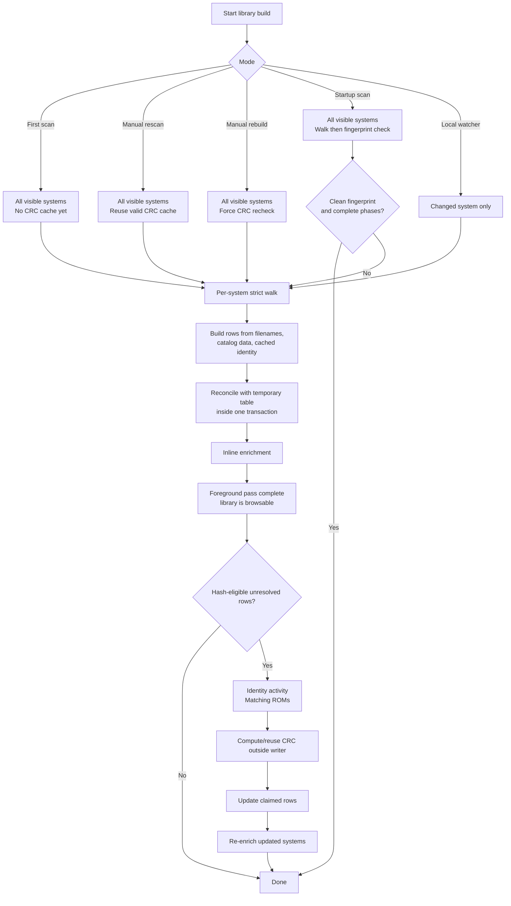

# Library Build Pipeline

This page documents the scan/rescan/rebuild path that populates `library.db`.
The goal is to keep the library correct on large ROM sets and high-latency NFS
storage without making the app unusable while optional identity work runs.

## Operation Modes

Startup scan, manual rescan, manual rebuild, and local watcher rescans all
share the same per-system building block:

1. Walk a visible system's ROM folder with the strict filesystem walker.
2. Build `GameEntry` rows from filenames, static catalog matches, and any
   reusable cached CRC identity.
3. Save the current rows for that system to `library.db`.
4. Run enrichment for that same system immediately.
5. Queue hash identity work when the system is hash-eligible.

The main differences are the startup no-op gate and the hash policy:

| Mode | Discovery write | Enrichment | Hash identity |
|---|---|---|---|
| First scan / fresh DB | Reconciles every visible system | Runs for each scanned system | No cache exists; queues hash-eligible rows for background identity |
| Startup scan | Walks every visible system; skips DB writes only when the durable per-system fingerprint and prior phase states are clean | Skips only with the same clean fingerprint gate | Reuses valid cached CRC rows; queues new/stale/failed rows |
| Manual rescan | Reconciles every visible system | Always runs for each successfully scanned system | Reuses valid cached CRC rows; queues new/stale/failed rows |
| Manual rebuild | Reconciles every visible system | Always runs for each successfully scanned system | Forces hash-eligible rows through background re-identification |
| Local watcher rescan | Reconciles the changed system | Always runs for each successfully scanned system | Reuses valid cached CRC rows; queues new/stale/failed rows |

First scan and manual rebuild both touch every visible system, but they differ
in why identity work is needed. First scan has no CRC cache yet, so all
hash-eligible rows start unresolved. Manual rebuild deliberately ignores the
existing CRC cache for eligible rows and verifies them again. Startup scan and
manual rescan both walk every visible system and catch ROMs added while Replay
Control was off. Startup uses the completed walk to compare a durable
per-system fingerprint made from relative paths, filenames, sizes, and mtimes.
If that fingerprint matches the last clean run, and discovery, enrichment, and
identity all completed previously, startup skips the DB write and enrichment
for that system. Manual rescan intentionally bypasses that gate so it can
refresh metadata without requiring a full hash rebuild.

Startup scan intentionally does not depend on top-level system directory mtimes.
Users often store ROMs in nested folders, and some storage backends do not make
parent directory mtimes a reliable signal for those changes. A full strict walk
is the correctness boundary; cached CRC identity keeps that walk from becoming a
full byte-read verification pass.

The rebuild activity completes when the foreground pass is done. Background
identity may still be running, but the library is already populated and
browsable. Identity owns the activity slot while it runs: the UI shows a
"Matching ROMs" progress banner and user-triggered rescan/rebuild requests are
blocked until matching finishes. This prevents ordinary user actions from
cancelling identity work and throwing away long NFS reads. Storage changes still
cancel stale identity work through the storage-generation guard.

ROM filesystem edits during a scan, rebuild, or identity pass are outside the
operation's consistency contract. The pass records the files it observed; after
changing ROMs during a long operation, the user should run a manual rescan.

## Flow

## Foreground Discovery

`populate_all_systems` iterates `visible_systems()` directly. It does not depend
on cached system summaries, and it does not pre-clear the library. Each system is
handled independently:

- A successful filesystem walk replaces that system's rows.
- A local missing system directory reconciles to empty metadata.
- An NFS missing/unreadable system directory is treated as ambiguous and
  preserves the previous cached rows.
- Storage-generation checks run before write boundaries so stale work cannot
  write into a newly-active storage DB.

The foreground pass includes enrichment because enrichment is what makes the
freshly-discovered rows useful: display metadata, release dates, descriptions,
resources, and thumbnail matches are written before the next system starts.
Startup is the only exception: when the post-walk fingerprint proves the system
is unchanged and the previous discovery, enrichment, and identity phases are
complete, enrichment is skipped for that system because the existing enriched
rows are already current.
Enrichment calculation runs outside the library writer. Repeatable per-ROM
updates such as developers, cooperative flags, release-date rows, and
box-art/genre/rating fields are flushed in bounded app-level chunks, with a
fresh writer acquisition per chunk. Splitting only inside a `LibraryDb` helper is
not enough because the single writer connection would still be held for the
whole system. Release-date mirror fields are resolved from `game_release_date`
through the reader pool, then written back to `game_library` in chunks.
Replace-style detail/resource data is staged in temporary tables first; live
game-detail rows are swapped only after all staged chunks have succeeded, so a
cancelled or failed pass does not clear old game-detail data. The final live
swap can still be a long writer on very large systems; generation-based
activation would remove that final hold, but that larger reader/schema change is
deferred.

## Scan-Token Reconcile

`LibraryDb::save_system_entries` reconciles one system using a durable
`scan_token` on `game_library` rows. This keeps writer holds bounded on very
large systems while avoiding a delete-first pass that would throw away derived
resources for unchanged ROMs.

The save path is:

1. Deduplicate the walker output by ROM filename, keeping the first entry.
2. Allocate a new monotonic token from `library_build_sequence`.
3. Mark the system discovery state as running.
4. Upsert current rows in bounded chunks, writing the new token on each row.
5. Finalize in a short transaction: delete rows for that system whose token is
   missing or old, cascade child rows for removed ROMs, update
   `game_library_meta`, and mark discovery complete.

If the process stops before finalization, stale deletes have not run. The next
startup/rescan allocates a new token and reconciles the system again. Readers may
briefly see old and new rows for the same system during a chunked save; that is
accepted so hot read paths do not need token joins.

## Deferred Identity Phase

Hash identity is the expensive part on large NFS libraries because it may stream
large cartridge ROM files over the network. It now runs after discovery:

1. The foreground scan writes rows with reusable cached identity where possible.
2. Hash-eligible systems are queued as `IdentityJob`s.
3. A bounded worker set claims 200-row mini-batches by marking those rows
   `Running`.
4. Workers compute or reuse CRCs outside the SQLite writer closure.
5. Results are applied only to rows still marked `Running` and still matching the
   expected size.
6. Completed mini-batches advance the activity progress immediately.
7. Updated systems are re-enriched so hash-derived names and metadata can flow
   into the library.

If storage changes, workers drop the in-flight batch and the next DB open/startup
demotes running rows back to retryable state. If a foreground activity starts,
workers flush completed rows from the current mini-batch, return unresolved rows
to `Pending`, and stop. Rescan/rebuild cannot normally start while identity is
active because identity owns the activity slot; the foreground-activity check
remains a defensive guard for races and other activity classes.

Worker defaults are intentionally simple: all storage classes use two workers.
`REPLAY_CONTROL_IDENTITY_WORKERS` can override the count in the range 1-4 for
controlled testing or unusually constrained storage.

## Performance Shape

The useful number for rebuild UX is now the foreground pass, not the complete
forced-hash tail. On the 95,495-ROM NFS development library, recent validation
showed the foreground scan/enrichment pass completing in roughly 145-148 s. In
beta.9, the same NFS library measured 194.1 s for manual rescan and 636.0 s for
manual rebuild because forced CRC work was on the blocking path.

The May 17 2026 beta.11 NFS validation used a larger 99,964-ROM library. Its
foreground populate finished in 280.1 s, then background identity processed
19,019 hash-eligible rows in 437.9 s, for 718.0 s end to end. That run was not a
like-for-like speed win over beta.9's forced rebuild baseline. The design goal it
validated was responsiveness: the library was already populated and browsable
while the long hash tail continued.

Follow-up validation on a 102,662-ROM NFS library showed the next bottleneck:
large enrichment writers still held the library writer for several seconds on
the biggest system, which delayed thumbnail completion writes. The mitigation is
to chunk repeatable enrichment writes at the app boundary so the writer pool is
released between batches, and to stage replace-style detail/resource data before
the live swap.

After those changes, a manual rescan on the same 102,662-ROM NFS library
completed in 313.3 s with cached identity fully reused. The run had no hard DB
failures and the UI banner cleared when the foreground pass completed. The
largest remaining writer hold was the staged detail/resource final swap for
`sinclair_zx` at about 13.8 s. That validates correctness and responsiveness for
beta.11, but leaves generation-based detail/resource activation as the next
focused improvement if this writer hold becomes user-visible.
